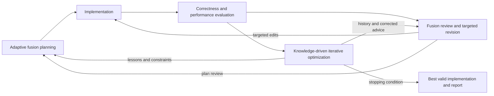

# FuseLoop

**Automated fused operator generation on NPUs**

FuseLoop jointly refines operator fusion plans and their Triton implementations using execution feedback from neural processing units (NPUs). Its multi-agent workflow implements three core modules: **adaptive fusion planning**, **fusion review and targeted revision**, and **knowledge-driven iterative optimization**. A deterministic software harness coordinates generation, evaluation, revision, and selection of the best valid implementation.

The method targets different NPU architectures through explicit hardware constraints and programming knowledge. Adapting this implementation to another target requires backend and runtime integration, device discovery, evaluation and profiling support, and knowledge of that target's computation, memory, and synchronization capabilities.

An **operator** is a computation such as matrix multiplication or normalization. A **fused operator** combines the computations of multiple operators; **operator fusion** is the optimization that combines them. An **implementation** is the concrete code realizing the fused operator. It can launch one or more **kernels**, the programs executed on the device, according to the selected fusion plan.

## Method

### Adaptive fusion planning

FuseLoop combines operator semantics, input shapes, data types, numerical requirements, and target hardware information with a [fusion catalog](knowledge/fusion_options.json) containing ten strategy families and 24 variants. The [strategy descriptions](knowledge/fusion_method.md) specify data flow, applicability, hardware requirements, and compatible combinations.

A decision model independently scores each family for the task and target. The harness validates the scores and retains the top three families by default, controlled by `fusion_selection.top_n`. The coding agent checks candidate feasibility against the target backend, then implements a plan with explicit kernel boundaries and intermediate-data handling. Measurements guide whether to retain, combine, or revise the plan.

Planning inputs are English. The harness validates requirements, catalog structure, identifiers, and request size before scoring and archives the input in `fusion/english_inputs.json`. Input fingerprints support reuse of unchanged scoring results; changing only the candidate count reselects from the saved ranking. The initial ranking and each iteration's actual fusion choice remain separate artifacts.

### Fusion review and targeted revision

Evaluation connects the generated implementation to numerical checks, execution traces, and case-level measurements. For performance diagnosis, the analysis agent examines up to six cases with the lowest speedups, maps kernels and data movement to source locations, and checks whether the bottleneck calls for local edits or fusion-plan review. Research findings are checked against the target's capabilities and supporting sources.

The reviewer produces P0/P1/P2 tasks with affected cases, files, changes, and acceptance checks. The harness validates these tasks before the coding agent executes them. Each revision receives fresh self-tests, including consecutive calls with the same shapes and changed inputs, followed by formal build, precision, and performance evaluation. Build failures, numerical mismatches, and evaluation anomalies return to review with their evidence.

### Knowledge-driven iterative optimization

Target-specific architecture and programming guidance are combined with records of successful changes, regressions, and corrected advice. Each lesson links an edit to measurements and states the hardware and input conditions under which it applies. Source and execution checks enforce evaluation integrity, including preservation of task inputs and independent correctness references.

The harness tracks valid results, per-case trends, and progress in the best implementation. Persistent slow cases trigger fusion-plan review; a passing implementation with sufficiently small recent gains can end optimization. Code and report snapshots preserve the best evaluated implementation throughout later revisions.



## Workflow stages

| Stage | Result |
|---|---|
| 1. Requirements | Operator analysis and compact fusion requirements |
| 1.5. Fusion selection | Ranked strategy families and a candidate library |
| 2. First implementation | Generated code, fusion rationale, and self-tests |
| 3. Fix and optimize | Reviewed changes, updated rationale, and fresh self-tests |
| 4. Build and deploy | Installed implementation and build log |
| 5. Precision evaluation | Results for the complete task case set |
| 6. Performance evaluation | Kernel timings, speedups, scores, and profiling data |
| 7. Profiling analysis | Bottlenecks tied to the evaluated implementation |
| 8. Optimization research | Applicable techniques and supporting sources |
| 9. Technical review | Validated revision tasks and accumulated knowledge |
| 10. Final report | Results and evidence from the best evaluated snapshot |

A new task starts at **1 → 1.5 → 2 → 4 → 5 → 6**. Build failures, precision failures, and evaluation anomalies route through **9 → 3 → 4**. If every case reaches the reference speed, Stage6 proceeds directly to Stage9. Otherwise, valid results follow **6 → 7 → 8 → 9 → 3 → 4**. The harness owns iteration limits and stopping decisions.

## Evaluation and implementation selection

Stage6 requests the `kernel_details` timing strategy with two warmup calls and three repeats. **Candidate time is the sum of per-kernel median execution times.** Repeated calls to the same kernel are summed within each repetition before taking medians; the metric covers all kernels needed to produce the outputs and excludes gaps between kernels. The evaluator supplies reference timing, per-case speedup, aggregate speedup (`avg_speedup`), and scores. FuseLoop retains these values with their raw reports and compares results with matching tasks, case sets, hardware, runtime, toolchain, evaluator, baseline files, and timing strategy.

A case reaches the performance target when its speedup is **at least 1.0**. An implementation enters the snapshot archive after formal precision checks and development self-tests pass, all case measurements are valid, and the evidence matches the evaluated code version.

Selection first prefers implementations that reach the target on every case, then chooses the highest reported `avg_speedup`; ties retain the earlier snapshot. Until an implementation reaches every case's target, the strongest eligible result is labeled `best_available`.

| Current result | Window setting | Action when improvement in the running best is below 5% |
|---|---|---|
| Every case reaches the target | `workflow.semantic_exit.passed_window` | Complete review and return the best passing snapshot |
| At least one case is slower than the reference | `workflow.semantic_exit.underperforming_window` | Review the fusion plan and continue optimization |

Both windows default to `3`: one valid baseline plus three subsequent valid iteration results. Invalid evaluations contribute no window step; changing between the two states starts a new window. A repeated evaluation in the same iteration counts once. The default iteration limit is `20`.

Measured gains and regressions produce lessons in the run's knowledge records. Eligible regressions that still reach every case's target can restore the best passing snapshot before further optimization. At a stopping condition or the iteration limit, `FINAL_REPORT.md` references the selected snapshot. Retrieve its code from the implementation path in `selection/best.json`; `impl/` remains the active development directory.

## Current implementation and experimental setup

The paper evaluates five fused operator tasks on an **Ascend 910B3 NPU**, using **CANN 9.1.0, Triton 3.2.0, and triton-ascend 3.2.1**. The tasks cover patch merging, attention preparation, residual modulation, window partition, and conditional normalization, with 154 test cases in total. The experiments use GLM5.3-Flash for generation and search, and kernelCAT for analysis and review.

This release integrates that runtime family. The method's target adaptation requirements above describe how to extend it to another NPU architecture. Compute units and on-chip memory resources are read and interpreted for the selected target.

Follow [Experimental setup and reproduction](docs/experiment_setup.md) for runtime prerequisites, agent installation, development resources, evaluator setup, and the exact configuration fields. Edit [config.yaml](config.yaml) for the machine before running. The main controls are `fusion_selection.top_n`, `workflow.max_iterations`, `workflow.semantic_exit`, and `workflow.human_review`.

## Run and resume

A task directory contains `desc.md`, `proto.yaml`, `cases.yaml`, and `golden.py`. From the repository root, start a run with the configured experimental environment:

```bash
python3 orchestrator.py --task-dir /path/to/task
```

Supply an optional fusion or optimization direction as a short string or a UTF-8 file:

```bash
python3 orchestrator.py --task-dir /path/to/task \
  --optimize-hint "Reduce intermediate memory traffic while preserving all case semantics."

python3 orchestrator.py --task-dir /path/to/task \
  --optimize-hint-file /path/to/direction.md
```

The hint options are mutually exclusive. Add `--max-iter N` to set the iteration limit or `--config /path/to/config.yaml` to select a machine configuration.

Each run creates `work/<operator>_<timestamp>/` and saves its checkpoint in `.state.json`. Resume with the same task, configuration, and work directory:

```bash
python3 orchestrator.py --task-dir /path/to/task \
  --work-dir /path/to/work/<operator>_<timestamp>
```

Start fresh evaluation from an existing FuseLoop implementation and its matching development evidence:

```bash
python3 orchestrator.py --task-dir /path/to/task \
  --init-impl /path/to/previous-work/impl
```

`--init-impl` creates a new work directory and imports the specified code, requirements, fusion library, and development artifacts. It begins at **Stage4 → Stage5 → Stage6**, evaluating that implementation before any revision. Startup verifies the task, hardware, and evidence and records hashes in `init_impl_manifest.json`. Evaluation history and selection records start fresh. Use `--work-dir` to resume the imported run; the two options are mutually exclusive.

## Human feedback

Submit directions or questions from another terminal while a run continues:

```bash
python3 tools/human_review.py --work-dir /path/to/work \
  --text "Keep the current fusion plan and focus on the two slowest cases."
python3 tools/human_review.py --work-dir /path/to/work \
  --kind question --text "Which measurement supports this change?"
python3 tools/human_review.py --work-dir /path/to/work --file /path/to/feedback.md
python3 tools/human_review.py --work-dir /path/to/work --status
```

Stage9 turns substantive directions into numbered P0 tasks. Stage3 records their implementation status in `develop/iterN/human_feedback.json`. Questions receive answers, and the archive preserves the original feedback, evidence, decisions, and execution status.

With consultation enabled, the third underperforming stagnation event generates a `questions_document.md` with options and a recommendation. The workflow waits two minutes; `please wait` grants one additional ten-minute interval. A substantive reply ends the wait. On timeout, the workflow follows the recommendation and records an automatic decision.

## Artifacts and tests

| Location | Contents |
|---|---|
| `orchestrator.py`, `lib/` | Execution control, evaluation, evidence validation, and agent integration |
| `roles/`, `roles/stage9/` | Stage instructions and scenario-specific review rules |
| `knowledge/` | Fusion catalog, target programming guidance, integrity rules, and profiling procedures |
| `examples/`, `tools/`, `tests/` | Example implementation, utilities, and regression tests |
| `<work>/fusion/`, `develop/` | Initial ranking, implemented plans, revision rationale, and self-tests |
| `<work>/build/`, `eval/`, `profile/`, `search/` | Per-iteration build, evaluation, analysis, and research records |
| `<work>/selection/` | Best-result index, evidence bindings, and independent evaluated snapshots |
| `<work>/knowledge/`, `human_review/` | Iteration history, reusable lessons, corrected advice, and feedback |
| `<work>/log/`, `FINAL_REPORT.md` | Execution logs, prompts, and final results |

Run strict offline checks and local subprocess tests with the setup guide's Python dependencies installed:

```bash
python3 tools/run_jev_offline_tests.py
python3 -m unittest discover -s tests -p 'test_agent_output_streams.py' -v
```

The strict offline suite uses synthetic measurements and mocked services to test routing, fusion selection, evidence binding, comparisons, snapshots, stopping conditions, feedback, and recovery. It blocks network access, child processes, and real credential-file reads, and records subprocess tests as skipped. Results and tested source hashes are saved to `output/jev_tests/results.json`. The second command tests output streaming with local Python subprocesses; standard `unittest` discovery includes both groups.

Run the generated implementation's self-tests and formal evaluations on the target NPU to obtain its correctness and performance measurements.
