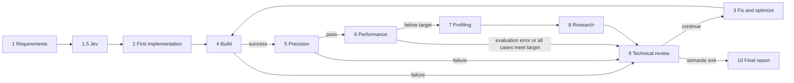

# FuseLoop

**Triton Ascend Loop Engineering**

FuseLoop develops and optimizes fused operators for Ascend NPUs through a repeatable loop of code generation, evaluation, profiling, and review. CANNBot implements Triton Ascend kernels, Kerminal builds and reviews them, Hermes researches optimization directions, and Jev ranks fusion strategies. A deterministic Python orchestrator controls stage transitions, evidence validation, checkpoint recovery, and final implementation selection.

## Workflow

| Stage | Executor | Result |
|---|---|---|
| 1. Requirements | CANNBot | Operator analysis and compact English fusion requirements |
| 1.5. Fusion selection | Jev + orchestrator | Ranked fusion methods and a top-N candidate library |
| 2. First implementation | CANNBot | Triton Ascend package, design rationale, and self-tests |
| 3. Fix and optimize | CANNBot | Reviewed changes, updated fusion rationale, and fresh self-tests |
| 4. Build and deploy | Kerminal | Installed operator package and build log |
| 5. Precision evaluation | Kerminal + cann-bench | Results for the task's complete case set |
| 6. Performance evaluation | Orchestrator + cann-bench | Kernel timings, speedups, scores, and profiler data |
| 7. Profiling analysis | Kerminal | Bottleneck analysis tied to the evaluated implementation |
| 8. Optimization research | Hermes | Applicable techniques and supporting sources |
| 9. Technical review | Kerminal | Validated decisions, file-specific modification plans, and accumulated knowledge |
| 10. Final report | Kerminal | Results and evidence from the best evaluated snapshot |



The orchestrator routes build failures, precision failures, and evaluation anomalies through Stage9 before repair. All-passing performance results proceed directly to Stage9; below-target results go through Stage7 and Stage8 first. Stage9 loads the rules for the current scenario and returns a validated plan for Stage3. The program owns iteration limits and exit decisions.

Core computation uses `triton`, `triton.language`, `@triton.jit`, and explicit launch grids. Development self-tests cover the provided cases and consecutive invocations with changed inputs. Formal precision and performance evaluation then establish the results used for selection.

## Fusion selection with Jev

Stage1.5 combines the operator requirements, detected hardware, [fusion method descriptions](knowledge/fusion_method.md), and [candidate definitions](knowledge/fusion_options.json). Jev assigns an applicability probability to each of ten method families. These are independent probabilities; the orchestrator ranks them and retains the top N, configured by `fusion_selection.top_n` (default: `3`).

Kerminal prepares English input when translation is needed. The program validates structure, identifiers, numbers, language, and request size before scoring. Input fingerprints support cache reuse: changed inputs trigger scoring again, while changing only N reselects candidates from the existing ranking.

Stages 2, 3, 7, 8, and 9 share the selected library. Initial probabilities guide exploration; measured results determine implementation choices. Each development iteration records its actual fusion scheme and rationale separately from the initial ranking.

Stage1 writes `fusion_requirements.en.json`. The `fusion/` directory preserves `fusion_library.json`, `ranking.json`, the Jev request and response, and translation records. Each iteration writes its implemented choice to `develop/iterN/fusion_library.json`.

## Evaluation and best implementation

Stage6 directly runs cann-bench with `--perf-metric-strategy kernel_details`, two warmup calls, and three repeats. **Candidate time is the sum of measured kernel execution durations for an invocation.** FuseLoop preserves cann-bench's baseline timing, per-case speedup, average speedup, HAP fields, and scores. Comparison groups bind the task and cases, hardware, runtime, CANN toolchain, evaluation tool, baseline files, and timing strategy.

A performance target is met when every case has speedup **at least 1.0**. A result enters the snapshot archive after formal precision passes, development self-tests pass, all case measurements are valid, and the evidence matches the evaluated code version.

Selection gives priority to implementations meeting the target on every case, then chooses the highest `avg_speedup`; ties retain the earlier snapshot. Until an all-passing implementation exists, the strongest eligible result is labeled `best_available`.

- `selection/best.json` identifies the selected implementation and its evidence.
- `selection/records/<record-id>/` contains independent copies of the code, reports, fusion rationale, and self-test evidence.
- `selection/current_implementation.json` binds the current development artifacts to the working code.
- `selection/state.json` tracks valid evaluations and stagnation windows.

Semantic exit uses the improvement in the running best `avg_speedup` across a valid window:

| Current result | Window setting | Action when cumulative improvement is below 5% |
|---|---|---|
| Every case meets the target | `workflow.semantic_exit.passed_window` | Complete Stage9 review and deliver the best passing snapshot through Stage10 |
| At least one case is below target | `workflow.semantic_exit.underperforming_window` | Review the fusion direction in Stage9 and continue optimization |

Both windows default to `3`, requiring one valid baseline plus three subsequent valid iteration results. Invalid evaluations contribute no window step; a change in pass status starts a new window. Repeating an evaluation in the same iteration counts once. The maximum iteration count defaults to `20`.

Comparable average-speedup improvements of at least 5% produce success records; regressions of at least 5% produce regression records. Stage9 explains the change, and the program supplies the measured numbers. For an eligible regression whose current result still passes every case, the program restores the best passing snapshot before further optimization. The work directory's `knowledge/` contains `history.json`, `proven_patterns.md`, `regression_patterns.md`, and `tech_lead_pitfalls.md`.

At semantic exit or the iteration cap, `FINAL_REPORT.md` references the best evaluated snapshot. Use the implementation path in `selection/best.json` to retrieve it; `impl/` is the active development directory.

## Installation

Run the workflow on Linux with an Ascend NPU. Prepare:

- Python 3.10 or later, with compatible CANN Toolkit, driver, `torch`, `torch_npu`, and Triton Ascend versions for the target device.
- A configured cann-bench checkout containing the task files and `examples/triton_ascend_cann_example/`.
- Node.js 20 or later for CANNBot and its skill installer, plus configured Kerminal and Hermes CLIs.
- Jev service credentials and the model/provider credentials required by the three agents.

Install the workflow's Python dependencies into the environment used to launch the orchestrator:

```bash
cd FuseLoop
python3 -m pip install "typesafe-sdk==0.7.0" "PyYAML==6.0.3"
```

Install the agent CLIs using their distributions:

```bash
npm install -g cannbot@1.1.2 @cannbot-ai/install-helper@1.2.0
curl -fsSL https://kerminal.cn/install.sh | bash
curl -fsSL https://hermes-agent.nousresearch.com/install.sh | bash
```

Configure CANNBot in `~/.config/opencode/opencode.jsonc`, Kerminal in `~/.kerminal/config.toml`, and Hermes in `~/.hermes/config.yaml` and `~/.hermes/.env`. Hermes's configured command must resolve to its Python entry point in its own environment. Full prompts are retained under `log/prompts/` and delivered through files and stdin or the Hermes Python bridge.

### CANNBot Triton resources

Run `install-helper` and select **Install Plugin → OpenCode → global → Triton operator development → Confirm**. This installs the eight Triton skills and the plugin's `AGENTS.md` under `~/.config/opencode/`. OpenCode is the configuration format selected in the installer; FuseLoop executes `cannbot`.

Verify discovery using the workflow's user, environment, and working directory. Set `CANNBOT_BIN` to `agents.cannbot.cli`. Capture the complete JSON to a regular file before parsing:

```bash
CANNBOT_BIN=cannbot
CANNBOT_CHECK=$(mktemp)
"$CANNBOT_BIN" debug skill > "$CANNBOT_CHECK"
python3 - "$CANNBOT_CHECK" <<'PY'
import json, sys
from pathlib import Path
available = {s["name"]: s for s in json.loads(Path(sys.argv[1]).read_text(encoding="utf-8-sig"))}
expected = """triton-task-extractor triton-op-designer triton-op-coding
triton-op-verifier triton-latency-optimizer triton-precision-debug
npu-arch triton-simulator-optimizer""".split()
missing = [n for n in expected if not Path(available.get(n, {}).get("location", "")).is_file()]
print(f"{8 - len(missing)}/8 Triton skills readable", missing)
raise SystemExit(bool(missing))
PY
```

Check the Triton instructions and templates separately. For the global installation, add the template link if its entry is absent, then verify both resources:

```bash
CANNBOT_PLUGIN="$HOME/.cannbot/repo/plugins-official/triton-op-generator"
CANNBOT_CONFIG="$HOME/.config/opencode"
test -r "$CANNBOT_PLUGIN/template/convolution.md"
if [ ! -e "$CANNBOT_CONFIG/template" ] && [ ! -L "$CANNBOT_CONFIG/template" ]; then
  ln -s "$CANNBOT_PLUGIN/template" "$CANNBOT_CONFIG/template"
fi
readlink -f "$CANNBOT_CONFIG/AGENTS.md"
test -r "$CANNBOT_CONFIG/AGENTS.md" && test -r "$CANNBOT_CONFIG/template/convolution.md"
```

Confirm `AGENTS.md` resolves to the installed Triton plugin. Resolve template references inside its skills, including `.claude/template/...` paths, to readable files under the installed template directory. Use these resources with FuseLoop's stage instructions and `cann_bench` package interface; the orchestrator controls the loop, Stage9 directs changes, and cann-bench supplies formal evaluation results.

## Configuration

Edit [config.yaml](config.yaml) to match the machine:

| Setting | Purpose |
|---|---|
| `agents.cannbot.cli`, `agents.kerminal.cli`, `agents.hermes.cli` | Commands on `PATH` or absolute executable paths; Hermes resolves to its venv's Python entry point |
| `paths.cannbench_repo` | Absolute path to the cann-bench checkout |
| `cann.toolkit_path`, `cann.driver_path` | Toolkit and driver locations; default toolkit: `/usr/local/Ascend/ascend-toolkit/latest` |
| `cann.arch`, `cann.node_bin` | Host architecture and optional Node.js binary directory; an empty `node_bin` uses `PATH` |
| `hardware.device_id` | Logical index of the NPU to use |
| `jev` | Service endpoint, model, credential lookup, timeouts, and request limits |
| `fusion_selection.top_n` | Number of fusion candidates, from 1 to 10 |
| `workflow.max_iterations` | Iteration cap |
| `workflow.semantic_exit` | Valid-result windows for exit and fusion review |
| `workflow.human_review` | Proactive feedback and stagnation consultation controls |

Jev reads `TYPESAFE_API_KEY` first, then `jev.api_key`. Keep credentials in the local environment when sharing the configuration. Use `--config /path/to/config.yaml` to select a machine-specific configuration.

At startup, FuseLoop reads the device's SoC and core information through `torch_npu`, queries UB/L1/L0 capacities through CANN's TBE interface, verifies Triton's active `npu` backend, and records runtime versions in `device_info.json`. These details inform every stage's tiling and implementation decisions.

Verify the installed components before running:

```bash
npu-smi info
python3 -c "import torch, torch_npu; print(torch.npu.is_available())"
python3 -c "from tbe.common.platform import get_soc_spec; print('CANN TBE ready')"
cannbot --version
kerminal --version
hermes status
```

## Run and resume

A task directory contains `desc.md`, `proto.yaml`, `cases.yaml`, and `golden.py`. Start a run from the repository root:

```bash
python3 orchestrator.py \
  --task-dir /path/to/cann-bench/bench_lab/<bench>/<level>/<operator>
```

Supply an optional optimization direction as a short string or a UTF-8 file:

```bash
python3 orchestrator.py --task-dir /path/to/task \
  --optimize-hint "Reduce intermediate memory traffic while preserving all case semantics."

python3 orchestrator.py --task-dir /path/to/task \
  --optimize-hint-file /path/to/direction.md
```

The two hint options are mutually exclusive. A new run applies the direction in requirements analysis and initial implementation. Add `--max-iter N` to set a run's iteration cap.

Each run creates `work/<operator>_<timestamp>/` and saves its checkpoint in `.state.json`. Resume with the same task, configuration, and work directory:

```bash
python3 orchestrator.py --task-dir /path/to/task \
  --work-dir /path/to/work/<operator>_<timestamp>
```

To start a fresh evaluation from an existing FuseLoop implementation and its development evidence:

```bash
python3 orchestrator.py --task-dir /path/to/task \
  --init-impl /path/to/previous-work/impl
```

`--init-impl` creates a new work directory, imports the specified code and matching requirements, fusion library, and development artifacts, then begins at **Stage4 → Stage5 → Stage6**. The first pass evaluates that exact implementation. Subsequent optimization follows the normal routing. Startup verifies the imported task, hardware, and evidence, and records file hashes in `init_impl_manifest.json`.

The imported run starts fresh evaluation history and selection records. `--init-impl` and `--work-dir` are mutually exclusive; a hint supplied with `--init-impl` guides subsequent optimization.

## Human feedback

Submit feedback from another terminal while the workflow runs:

```bash
python3 tools/human_review.py --work-dir /path/to/work \
  --text "Keep the current fusion scheme and focus on the two slowest cases."

python3 tools/human_review.py --work-dir /path/to/work \
  --kind question --text "Which measured bottleneck supports this change?"

python3 tools/human_review.py --work-dir /path/to/work --file /path/to/feedback.md
python3 tools/human_review.py --work-dir /path/to/work --status
```

Stage9 turns directions into numbered P0 items, then Stage3 records their implementation status in `develop/iterN/human_feedback.json`. Questions receive answers before any modification direction is formed. The feedback archive retains the original wording, supporting evidence, decisions, and execution status.

With consultation enabled, the third underperforming stagnation event generates a `questions_document.md` with options and a recommendation. The workflow waits two minutes; a `please wait` reply grants one additional ten-minute interval. A substantive reply ends the wait. On timeout, the workflow continues with the recorded recommendation and labels the outcome as an automatic decision.

## Repository and run artifacts

| Location | Contents |
|---|---|
| `orchestrator.py`, `lib/` | Routing, evaluation, evidence, selection, and agent integration |
| `roles/`, `roles/stage9/` | Stage instructions and scenario-specific review rules |
| `knowledge/`, `skills/` | Fusion methods, architecture guidance, evaluation rules, and profiling procedures |
| `examples/` | Minimal Triton Ascend operator and standalone Jev inputs |
| `tools/`, `tests/` | Human feedback, smoke-test utilities, and offline regression tests |
| `<work>/develop/`, `build/`, `eval/`, `profile/`, `search/` | Per-iteration development and evaluation artifacts |
| `<work>/operator_iter/`, `selection/` | Implementation backups and evaluated snapshots |
| `<work>/knowledge/`, `human_review/` | Iteration memory, review decisions, and human feedback |
| `<work>/log/`, `FINAL_REPORT.md` | Execution logs, full prompts, and final results |

The run's `task/` points to the supplied cann-bench task, and `example/` points to the configured checkout's `examples/triton_ascend_cann_example/`. The repository's [minimal fused operator](examples/triton_ascend_example/README.md) includes its own build and NPU self-test commands.

## Offline tests

Run strict offline checks and local subprocess tests on a development machine with the workflow's Python dependencies installed:

```bash
python3 tools/run_jev_offline_tests.py
python3 -m unittest discover -s tests -p 'test_agent_output_streams.py' -v
```

The strict offline suite covers routing, fusion selection, evidence binding, performance comparison, snapshot selection, semantic exit, human feedback, and checkpoint recovery using synthetic measurements and mocked services. It blocks network access, child processes, and real credential-file reads, and records the subprocess tests as skipped. Results and tested source hashes are saved to `output/jev_tests/results.json`.

The second command tests output streaming with local Python subprocesses. Standard `unittest` discovery includes both groups.

Execute the NPU self-tests and the full workflow on the target Ascend environment to obtain kernel correctness and performance measurements.
