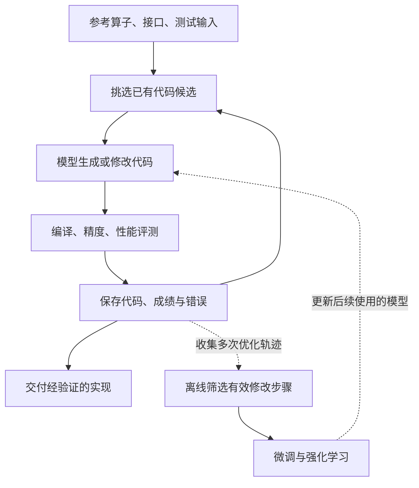

# Kernel-Smith 论文主线与算子开发工作

**主线是：把算子开发做成可测量、可搜索的迭代过程，再把有效优化步骤用于训练模型。** 前一层提高当前算子的性能，后一层提高模型今后改算子的能力。

以 Kernel-Smith 主论文为依据，结合你保存的[知乎原文](Kernel-Smith-知乎原文.md)；2026-09-25 补查公开仓库、数据集和合入代码。下面的工作拆分是按技术职责归纳，论文没有披露实际团队编制、人数或工期。

## 1. 两层循环怎样连接

运行时循环更新的是**候选代码和搜索记录**；模型训练是另一个阶段。论文图 2 把这两部分分开展示。[论文 §3—4，PDF 第4页](papers/00_Kernel-Smith_2603.28342v2.pdf)

## 2. 一次算子开发具体怎么做

1. **定义任务。** 提供参考实现、调用接口、测试输入和目标硬件，明确功能不能变。
2. **挑选参考版本。** 从候选库中取高性能及不同特点的实现，避免后续一直被第一条路线限制。论文基于 OpenEvolve 组织搜索。
3. **生成新代码。** 给模型参考代码、硬件、历史尝试、优秀候选、当前版本及其成绩或报错，再要求修改。
4. **独立验证。** 评测服务执行编译、精度检查和计时，并检查是否实际执行了生成的 kernel；结果再反馈给搜索程序。
5. **持续比较并交付。** 保存值得继续探索的版本；用于真实项目时，还要补测试、接回原系统、验证整体收益。

附录的提示词示例还限定了可修改代码区域。它展示的是**选出的候选代码加结构化反馈**，而非一份笼统的“继续优化”要求；示例经过简化，不能据此推定完整系统的所有限制。[论文 §3、§6、附录 A，PDF 第16—17页](papers/00_Kernel-Smith_2603.28342v2.pdf)

## 3. 围绕算子开发，要建设多少东西

按交付物可以拆成 **7 类工作**。这不是论文宣称的七个团队，也不是必须同时建设的七个阶段。

| 工作 | 要完成什么 | 应交付什么 |
|---|---|---|
| 任务与数据整理 | 提取参考实现、补依赖和 case，去重并确认可运行 | 规范化算子任务集 |
| 硬件评测 | 管理编译、精度、计时噪声和执行检测，适配各后端 | 可信且可复用的评测服务 |
| 候选搜索 | 保存不同代码版本，决定从哪个版本继续、给模型哪些参考 | 候选库与搜索调度 |
| 代码生成 | 组织提示词、硬件信息和修改边界，处理反馈 | 可编译、可验证的新实现 |
| 实验与轨迹管理 | 关联每次修改、成绩和错误，选出有效优化步骤 | 可追溯的实验记录与训练样本 |
| 模型训练 | 用样本微调，再用实测收益做强化学习 | 更擅长修改算子的模型 |
| 工程集成 | 回接上游项目，补覆盖测试，测完整系统收益 | 可合入、可维护的算子实现 |

**我们的需求整理、评测、代码生成和历史记录已有基础；多候选代码搜索、训练数据处理和模型训练仍需补充。** 这只是职责对应，不代表现有实现已达到论文的规模或效果。

论文也包含人工工作：代表性样本的清洗、专家标注，以及识别“只优化简单部分”的问题。因此，“自动优化”不等于完全没有专家。[论文 §3.3、§4.2、§6](papers/00_Kernel-Smith_2603.28342v2.pdf)

## 4. 模型训练为什么是另一项大工程

论文报告整理了约 **5.9 万个模块、20 类功能**，形成 **20 万条以上微调样本**；这些需要补依赖、补测试、执行筛选，还要调用教师模型产生优化过程。

训练先用正确翻译与有效修改的样本做监督微调（SFT），再用实测收益做强化学习。强化学习阶段，每条样本生成 8 个候选，以相对父版本的加速作为奖励。这些是训练采样数量，不能理解成运行时每轮固定并行 8 个方案。[论文 §4](https://arxiv.org/html/2603.28342v2#S4)

对我们的启示是：**knowledge 文档能指导下一轮，但不能直接等同于训练数据。** 如果将来要训练，还需整理修改前后的代码、对应输入、评测证据及收益，并重新验证和筛选。

## 5. 公开材料能确认什么，不能确认什么

**公开的是论文、部分训练相关数据和具体生成内核；完整生成系统尚未公开。** 这三个层次必须分开，不能只看主仓库，也不能用“源码未公开”推论其效果不好。

### 5.1 完整系统与复现

官方明确说明**目前不计划发布模型权重和 agent 代码**。2026-09-25 通过 GitHub API 复核：只有 `main` 分支，提交仍为 `e5b8228`，完整文件树仅 README、LICENSE；无 tag、release，两个公开 fork 也仅有这两个文件。唯一 issue 是在线平台注册问题，没有提供另一套实现。[官方说明](https://github.com/InternLM/Kernel-Smith)、[分支](https://api.github.com/repos/InternLM/Kernel-Smith/branches)、[标签](https://api.github.com/repos/InternLM/Kernel-Smith/tags)、[发布记录](https://api.github.com/repos/InternLM/Kernel-Smith/releases)、[issue](https://github.com/InternLM/Kernel-Smith/issues/1)

论文给出搜索、评测、训练设计和简化提示词，但候选库容量、具体选择参数、完整打分公式和停滞退出规则等未充分公开。**通用 OpenEvolve 源码不能替代其私有适配与训练权重，公开数据也不能直接还原原系统。** 40 轮是 KernelBench 实验预算；RL 的 8 个候选是训练采样数。[论文 §3—5、附录 A](papers/00_Kernel-Smith_2603.28342v2.pdf)

**按最新明确的 RQ1 口径，未开源不再是排除理由：Kernel-Smith 可作为在线平台对比对象。** 使用平台生成面向 910 的实现，再拿回本地统一评测即可，不要求在本地部署原 Agent。官方提供了[在线体验入口](https://chat.intern-ai.org.cn/kernel-smith)，但本次浏览器未登录访问跳回书生首页，尚未确认专用页面的任务输入、代码获取功能是否可用；这是平台访问状态，不能记为生成失败。论文已验证 NVIDIA、MetaX，不能据此提前保证网页生成的代码适配 910。[官方入口说明](https://github.com/InternLM/Kernel-Smith)、[论文 §3.3](papers/00_Kernel-Smith_2603.28342v2.pdf)

### 5.2 此前遗漏的公开数据

Hugging Face 的 CoopReason 已发布以下数据。其成员及上传者 `njuhzx` 的公开身份是论文作者 Zixian Huang，个人页也关联主论文，因此可确认作者关联；不能仅因引用了论文就认定是完整训练集。[作者页](https://huggingface.co/njuhzx)、[组织成员](https://huggingface.co/api/organizations/CoopReason/members)、[上传记录](https://huggingface.co/datasets/CoopReason/Kernel-Smith-RL-2K/commits/main)

| 数据 | 实际行数 | 已核对的内容 |
|---|---:|---|
| [Seed-59K](https://huggingface.co/datasets/CoopReason/Kernel-Smith-Seed-59K) | 59,830 | 参考代码、来源仓库、入口和难度 |
| [SFT-71K](https://huggingface.co/datasets/CoopReason/Kernel-Smith-SFT-71K) | 71,675 | `messages` 格式的训练对话 |
| [RL-2K](https://huggingface.co/datasets/CoopReason/Kernel-Smith-RL-2K) | 2,002 训练 + 15 验证 | 提示词、父代码、参考答案及奖励相关字段 |

行数和字段已用数据集服务核对。**公开 SFT 数量不等于论文所报的 20 万余条；数据卡没有说明两者完整对应关系。** 本轮未下载大规模数据、未训练，也未据此验证论文成绩。

### 5.3 已公开的融合实现

以下三项官方列出的 PR 均已核对为合入，并检查了代码差异。它们公开的是优化结果及部分测试，不是生成这些结果的完整 agent。

| 项目 | 实际公开的融合范围 | 代码及合入日期 |
|---|---|---|
| SGLang | 序列长度更新、前缀和、页表 gather/换算；按 page size 和滑窗条件走专用或通用内核，并附独立测试 | [PR #20778](https://github.com/sgl-project/sglang/pull/20778/files)，2026-03-22 |
| LMDeploy | sigmoid、bias、组选取和 mask 融合；最终专家 `torch.topk`、gather、归一化仍在 PyTorch 中 | [PR #4345 的 fused_noaux_tc.py](https://github.com/InternLM/lmdeploy/blob/967217481602f1d4f1e394560fadc829c789956a/lmdeploy/pytorch/kernels/cuda/fused_noaux_tc.py)，2026-02-11 |
| DLBlas Engram | 两个 Triton 内核分别处理门控/RMS 和卷积/激活/残差；投影仍调用 `F.linear` | [PR #102 的 engram.py](https://github.com/DeepLink-org/DLBlas/blob/67cf44611f0e898935308c07e315f92563cf9f4d/dlblas/kernels/engram.py)，2026-02-14 |

所以，**它已经能产出部分融合、多内核和按条件分支的实现，不能说它只会单算子或强制单 kernel。** 4.78×、1.36×、14.59× 仍是论文指定配置下的局部成绩，不是本轮复测，也不是整个模型的加速比。[论文 §6](papers/00_Kernel-Smith_2603.28342v2.pdf)

### 5.4 本轮复核范围与边界

- **本地材料：** 本目录三份分析 MD、知乎原文、下载记录、17 页论文（含 §3—6 和附录 A）、仓库 ZIP 全部条目及 README、LICENSE 均已检查；原文、PDF、原仓库和旧下载记录未修改。
- **公开渠道：** GitHub 主仓库的分支、标签、release、issue、完整树和两个 fork；仓库贡献者 [libowen2121](https://github.com/libowen2121?tab=repositories)、[QipengGuo](https://github.com/QipengGuo?tab=repositories) 及 [CoopReason](https://github.com/CoopReason) 的公开仓库目录；GitHub/Hugging Face 搜索 `Kernel-Smith`、`KernelSmith`；论文项目链接和三个上游 PR。
- **未找到与访问限制：** 上述范围未发现属于原项目的另一份完整 agent 或权重。Hugging Face 搜出的 YMRohit/OUROBOROS 属于另一项目，未算作原版；ModelScope 站内结果页无法读取，站外限定域名检索未找到对应发布，不能据此断言其站内绝无资源。在线 demo 未运行，也没有向作者索取非公开资料。

## 6. 我们可以怎样借鉴

建议先做两件可独立验证的事：**在可信评测基础上保留少量实测代码候选；把修改前后及收益记录成可比较的证据。** Stage9 据此选择继续哪个方向，沿用现有的最佳版本、语义退出与人工参与规则。

等这套流程积累到足够多、覆盖足够广的有效轨迹，再评估是否值得投入模型训练。这样能分步验证收益，也便于发现问题来自生成、搜索还是评测。

## 本地资料与阅读顺序

1. [主论文 v2 PDF](papers/00_Kernel-Smith_2603.28342v2.pdf)：2026-04-23 版本，共17页。先看第4页图2，再看 §3、§4，最后看第16—17页提示词。
2. [官方仓库 README](github/Kernel-Smith-main/README.md)：已解压；[原始 ZIP](github/Kernel-Smith-main.zip)也保留。快照提交为 `e5b82282229c5cf13ffd2755bb4e4a3b638aae89`。
3. [复核后的简要分析](Kernel-Smith_简要分析.md)：结论与项目对比；[下载记录](下载记录.json)保存来源地址、版本和文件校验值。

初次核对：2026-09-24；扩大复核：2026-09-25。本轮读取公开 API、数据页面及 PR 差异，没有新增下载文件，未运行在线演示或复现训练、性能实验。
