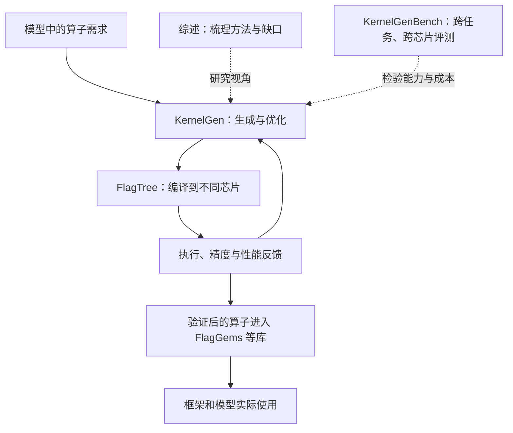

# FlagOS：论文与算子开发主线

核对日期：2026-09-25。

## 有没有论文主线

**有清楚的工程分工，也有直接相关论文；目前未找到官方把整个 FlagOS 串成“论文 A → 论文 B → 论文 C”的路线图。** 本次确认并下载两篇：领域综述和 KernelGenBench。尚未找到 KernelGen 平台本体的独立算法论文；综述也将它引用为网站／GitHub 项目。

## 两篇论文分别回答什么

### 1. 领域综述：算子自动开发需要哪些能力

**Towards Automated Kernel Generation in the Era of LLMs**，智源与合作高校；2026 年 1 月首发，本次保存 v3（6 月 6 日），9 页。

它整理模型训练、Agent 迭代、数据与知识、评测等研究。对我们尤其相关的是：**优化过程的经验要留下来，执行反馈和 Harness 要做好，人类专家要能有效指导。** 这些是综述提出的研究方向，不能当作 KernelGen 已全部实现的功能。[论文主页](https://arxiv.org/abs/2601.15727v3)、[本地 PDF](papers/01_Automated_Kernel_Generation_Survey_2601.15727v3.pdf)

**第 2 页图 1 就有一张发展图，但它画的是整个领域，包括其他团队，并非 FlagOS 自家的论文路线。** 因此不能把图中的 Kernel-Smith、其他 Agent 和评测论文都归给 FlagOS。

### 2. KernelGenBench：生成能力能否经得住换任务、换芯片

**KernelGenBench: Can LLMs and Agents Write Efficient Kernels Across Operator Sources and Hardware Platforms?**，智源与合作高校；2026 年 7 月首发，本次保存 v3（9 月 9 日），含附录共 30 页。仓库 README 及 `github/KernelGenBench-main/paper/` 中的 24 页旧稿沿用副标题 *A Multi-Source and Multi-Chip Benchmark…*，是同一篇论文的不同稿件；本文按 `papers/` 中的 v3 分析，数字不混用。

它把评测拆成两个视角：**210 个算子在 NVIDIA 上比较不同任务来源；110 个 ATen 算子在六个平台上比较迁移效果**，不是 210×6 的全组合。除正确性、速度，还统计生成成本，并检查是否绕过实际算子实现；硬件 profiling 检查仅在 NVIDIA 上执行。[论文主页](https://arxiv.org/abs/2607.27231v3)、[本地 PDF](papers/02_KernelGenBench_2607.27231v3.pdf)

价值在于说明：在熟悉的算子和芯片上表现好，不代表换环境仍然好。**这是评测论文，其被测 Agent 的成绩不能当成 KernelGen 平台的成绩。** 两个匿名平台也不能自行对应到厂商。

**配套源码包含真实 Agent 闭环，不只有测试集。** `agent_bench/run.py` 调度任务；`methods/normal_cc`、`normal_opencode` 启动外部 Agent 并注入“写代码—执行验证—读反馈—修改”的步骤；`tools/verify_single.py` 执行精度与性能验证、返回结果并保存日志。硬件侧还有 `device_manager.py` 的 NPU 管理和 `templates/ascend/`。这些属于 **KernelGenBench 的被测方法接入与评测实现**，不是 KernelGen 平台生成服务的开源实现。[Agent 目录](github/KernelGenBench-main/agent_bench)、[Ascend 依赖](github/KernelGenBench-main/requirements/requirements_ascend.txt)

论文附录 F 比较完整的“模型＋Agent＋工具”系统，在统一任务和 30 分钟预算下保留各方法自带的 Skills、profiling 等机制。它可支持我们关于 Harness 和开发成本的论证；不能证明“通用 Agent 完全不会融合”。公开提示词本身就要求在适当时合并 kernel 调用。[论文附录 F](papers/02_KernelGenBench_2607.27231v3.pdf)、[优化提示词](github/KernelGenBench-main/agent_bench/methods/normal_cc/templates/instructions.md)

## 怎样理解它的开发主线

下面是根据公开项目归纳的关系图，**不是官方论文继承图，也不表示先写综述才开发平台**：

工程关系依据 [KernelGen](https://github.com/flagos-ai/KernelGen)、[FlagTree](https://github.com/flagos-ai/FlagTree)、[FlagGems](https://github.com/flagos-ai/FlagGems)。虚线表示本文归纳的研究联系，不表示综述中的方法已接入平台。

## 围绕算子开发，要做多少工作

至少有五块工作需要持续配合：

1. **生成与优化**：让 Agent 会写、会测、会根据反馈修改。
2. **编译与硬件适配**：同类算子换芯片后能运行，并利用对应硬件能力。
3. **算子库维护**：统一接口，覆盖 shape、精度与布局，防止更新后退步。
4. **应用接入**：让框架和模型真正调用这些算子，验证整体收益。
5. **评测研究**：比较任务难度、迁移效果、失败原因和开发成本。

这与其官方分工一致：生成组维护 KernelGen／KernelGenBench，编译组维护 FlagTree，算子组维护 FlagGems 等，框架组和芯片组承担接入、适配。[官方工作组列表](https://github.com/flagos-ai/community/blob/main/sigs/README.md)

**对我们最有用的判断：他们围绕算子开发建设一套软件体系；我们当前主要深入其中的融合算子迭代流程。** 可先把这条流程的效果与证据做扎实，再逐步扩展评测和应用接入，不必同时复刻整套生态。
